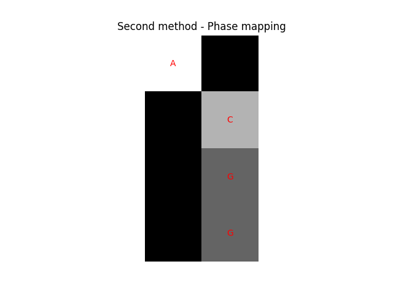

# DNA to quantumImage

This repo contains some simple examples of how we could encode DNA into quantum images.

Here, two approaches were taken:

1 - The first one encodes each nucleotide into a different pixel color using `NEQR`.

2 - The second one is inspired on `NEQR` method, however this time we encode each base using a different phase, then to retrieve the encoded values is necessary to measure in two different basis and distinguish those values with post-processing.

for enlightment, take a look at the code [here](./example.ipynb)
